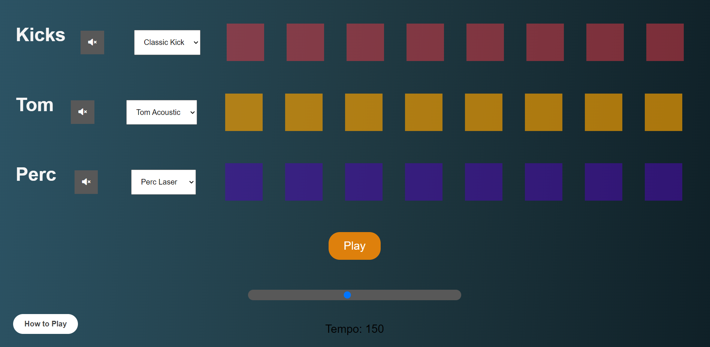

# BeatMaker 🎼

BeatMaker is the small app that use to mke some random beat with the some of the most simple tunes and a fun way to make a more love to the music 🎧

## Documentation 📃

2. [HTML](https://developer.mozilla.org/en-US/docs/Web/HTML)
3. [CSS](https://developer.mozilla.org/en-US/docs/Web/CSS)
4. [JavaScript](https://developer.mozilla.org/en-US/docs/Web/JavaScript)

## Demo

[Live Demo 💻](https://beat-maker-seven.vercel.app/)

## Screenshots 🖼️

## Features 😁

- Tempo use to make the change to the speed of the music 😍
- Stop , Play , Change and make different tune in Go 👟

## Authors

- [@mohammedkharodawala](https://github.com/mohammedkharoda)
